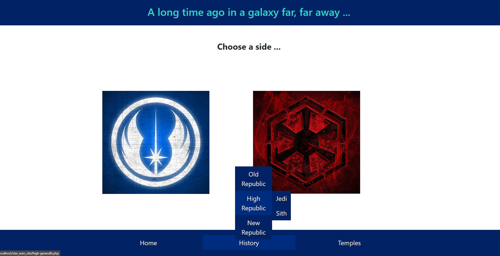
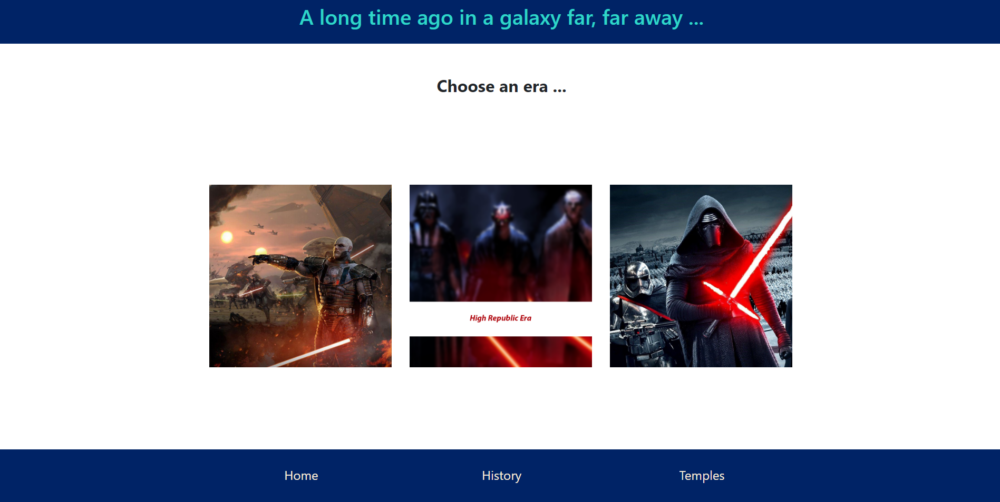
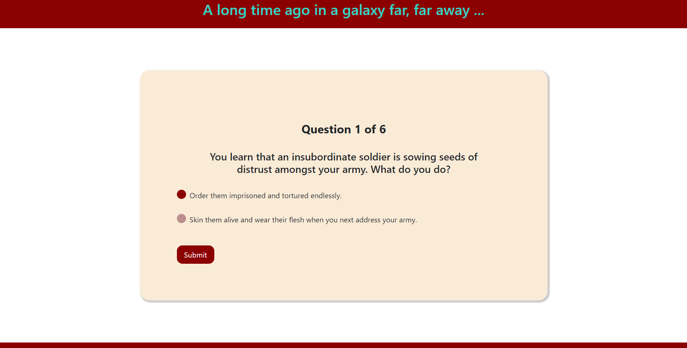

# Star Wars Website

An interactive website inspired by online quizes, where you can find out your Jedi or Sith master. There are also additional pages with information
about both sides through the ages.

The website was designed with the purpose of learning HTML, CSS, PHP and JavaScript, as well as for creating a fun activity to do when you are bored.

## Installation

For running the website we will need XAMPP installed.

Open the XAMMPP and start the Apache server.

Inside the "~path~/xampp/htdocs" add the folder named "star_wars_site"

In the broweser search bar type "localhost/star_wars_site"

## Testing

